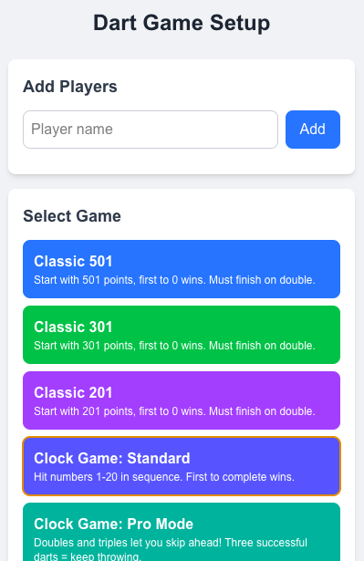
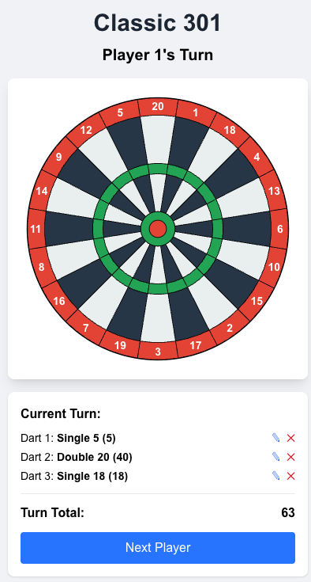

# Dart Game Collection

Use if you are too lazy to count in your head.

[](https://darts-henna.vercel.app/)

## Features

- **Interactive Dartboard** - Click to throw darts in different sections
- **Multiple Game Modes**:
  - **Classic Games** (501, 301, 201) - The traditional countdown games
  - **Clock Game** - Hit numbers in sequence from 1-20
  - **Multiply Game** - Build multipliers and score points

## Game Descriptions

### Classic Games (501, 301, 201)
- Start with a set number of points (501, 301, or 201)
- Take turns throwing darts to reduce your score
- Must finish exactly on zero with a double

### Clock Game
- Hit numbers in sequence from 1-20
- Multiple variants:
  - **Standard** - Basic sequential gameplay
  - **Pro Mode** - Doubles and triples let you skip ahead
  - **Streak Mode** - Hit all 3 darts to continue your turn

### Multiply Game
- Each round focuses on a different target number (1-20)
- First 3 darts: Build a multiplier by hitting the target number
- Second 3 darts: Score points which get multiplied by your factor
- Bullseye always counts for factor (2x for single, 3x for double)
- If multiplier is zero your overall score gets halved

## Screenshots





## Run

```bash
# Install dependencies
npm install

# Run the development server
npm run dev
```

Open [http://localhost:3000](http://localhost:3000) in your browser to play.

